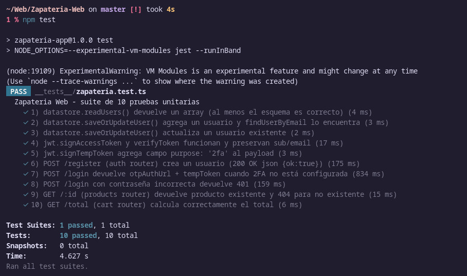

# 🥿 Zapatería Aether

Proyecto académico desarrollado con **Bootstrap**, **TypeScript** y **Express**, que simula una tienda de zapatos con sistema de autenticación, catálogo y carrito de compras funcional.  
El proyecto está estructurado bajo el patrón **MVC**, con un frontend liviano y un backend modular.

---

## Integrantes y Roles

| **Nombre**                         | **Rol Principal**           |
|-----------------------------------|-----------------------------|
| Camilo Andrés Angarita Ramírez   | Backend Developer           |
| Carlos Fernando Aragón López     | Frontend Developer          |
| César David Montoya Luna         | Full-Stack Developer        |
| Diego Mauricio Páez González     | Documentación y QA Tester   |

---

## Dependencias Utilizadas

### Dependencias principales

| **Paquete**         | **Descripción**                                                                 |
|---------------------|---------------------------------------------------------------------------------|
| **express**         | Framework de servidor para manejar rutas HTTP.                                  |
| **body-parser**     | Permite procesar cuerpos de solicitudes en formato JSON.                        |
| **cors**            | Habilita peticiones desde distintos orígenes (front-back).                      |
| **cookie-session**  | Manejo de sesiones mediante cookies.                                            |
| **bcrypt**          | Cifrado seguro de contraseñas.                                                  |
| **jsonwebtoken**    | Generación y verificación de tokens JWT para autenticación.                     |
| **qrcode**          | Generación de códigos QR para el setup del 2FA.                                 |
| **speakeasy**       | Implementación del sistema de autenticación en dos pasos (TOTP).                |

### Dependencias de desarrollo

| **Paquete**        | **Descripción**                                         |
|--------------------|---------------------------------------------------------|
| **typescript**     | Tipado estático y compilación a JavaScript.             |
| **ts-node**        | Ejecución de archivos TypeScript directamente.          |
| **@types/***       | Tipos de TypeScript para las dependencias externas.     |

---

## Descripción General de las Rutas del Backend

El servidor **Express** gestiona tres grupos principales de rutas:

### 1. Rutas de Productos (`/api/products`)

- **GET `/api/products`** → Retorna el catálogo completo de productos.  
- **GET `/api/products/:id`** → Devuelve un producto específico por ID.

Implementadas en `src/routes/products.ts`.  
Estas rutas permiten que el frontend obtenga la información de los zapatos disponibles (nombre, precio, descripción, imagen, stock).

---

### 2. Rutas del Carrito (`/api/cart`)

- **GET `/api/cart/total`** → Calcula el total del carrito sumando *precio × cantidad*.  
- *(Opcionalmente pueden existir rutas `/add`, `/remove`, `/clear`, según el `cart.js` del frontend).*

 Implementadas en `src/routes/cart.ts`.  
Estas rutas permiten simular un carrito de compras dinámico que persiste por sesión y actualiza el total en tiempo real.

---

### 3. Rutas de Autenticación (`/api/auth`)

- **POST `/register`** → Registra un nuevo usuario (email y contraseña).  
- **POST `/login`** → Inicia sesión y genera un token temporal (`tempToken`).  
- **POST `/2fa-verify`** → Verifica el código de autenticación de dos factores (2FA) y devuelve el `accessToken` final.

 Implementadas en `src/routes/auth.ts`.  
Este módulo utiliza **bcrypt** para el cifrado de contraseñas, **speakeasy** y **qrcode** para el sistema TOTP, y **jsonwebtoken** para la gestión segura de sesiones.

---

##  Funcionamiento del Carrito e Integración Front-Back

El **frontend** (ubicado en la carpeta `public/`) utiliza **Bootstrap 5** para el diseño y se comunica con el backend mediante `fetch()` hacia las rutas `/api/products` y `/api/cart`.

En `cart.html`, el archivo `cart.js`:

1. Llama a `/api/products` para obtener los productos.  
2. Llama a `/api/cart` para obtener los ítems actuales del carrito.  
3. Renderiza dinámicamente la tabla con nombre, precio, cantidad y subtotal.  
4. Usa botones **“+”**, **“−”** y **“Quitar”** que envían peticiones `POST` al backend para modificar el carrito.  
5. Actualiza automáticamente el total y el contador visual en el ícono del carrito.  

El **backend** responde a estas peticiones gestionando el estado del carrito (almacenado en memoria o sesión).  
Gracias al uso de **Fetch API** y **Express JSON Middleware**, se logra una comunicación fluida entre el cliente y el servidor sin recargas de página.

---

## Ejecución del Proyecto

Instala las dependencias e inicia el servidor en modo desarrollo:

```bash
npm install
npm run dev
```

El servidor estará disponible en:
http://localhost:3000

# pruebas 


