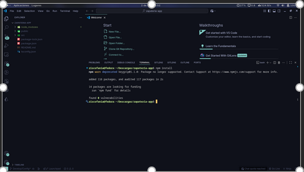
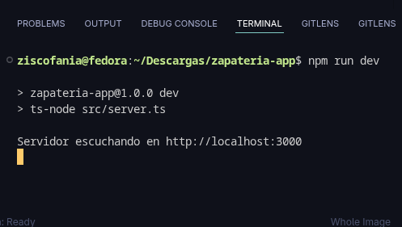

# INSTRUCCIONES DE INSTALACIÓN Y CONFIGURACIÓN

Este documento describe los pasos realizados para instalar, configurar y ejecutar el entorno del proyecto **Zapatería App**.

---

## 1. Requisitos previos

Asegúrate de tener instalados:

- **Node.js** v18 o superior  
- **npm** v9 o superior  
- Editor de código (VS Code recomendado)

---

## 2. Instalación del proyecto

1. Clonar el repositorio 
   ```bash
   git clone https://github.com/Ziscofania/Zapateria-Web.git
   ```
   ```bash
   cd zapateria-app
   ```
Instalar todas las dependencias del proyecto:
```bash
npm install
```
3. Configuración del entorno

Verificar que el archivo package.json contiene los siguientes scripts:
```bash
"scripts": {
  "dev": "ts-node --esm --transpile-only src/server.ts",
  "build": "tsc",
  "start": "node dist/server.js"
}
```
El servidor se ejecutará en el puerto 3000 por defecto.

4. Ejecución del servidor

Iniciar el servidor en modo desarrollo:

```bash
npm run dev
```

El sistema debe mostrar en consola algo similar a: **Servidor corriendo en** http://localhost:3000


Abrir el navegador y acceder a:

http://localhost:3000

Verificación del funcionamiento, verificar que la página de inicio carga correctamente.

Comprobar que las rutas principales (/api/products, /api/cart) devuelven datos válidos.

Confirmar que el carrito responde a las acciones de agregar o eliminar productos.
Evidencia

Capturas de pantalla

### Resultado de la instalación con npm install.



**Ejecución del comando npm run dev sin errores.**



Página o endpoint visible en el puerto 3000.